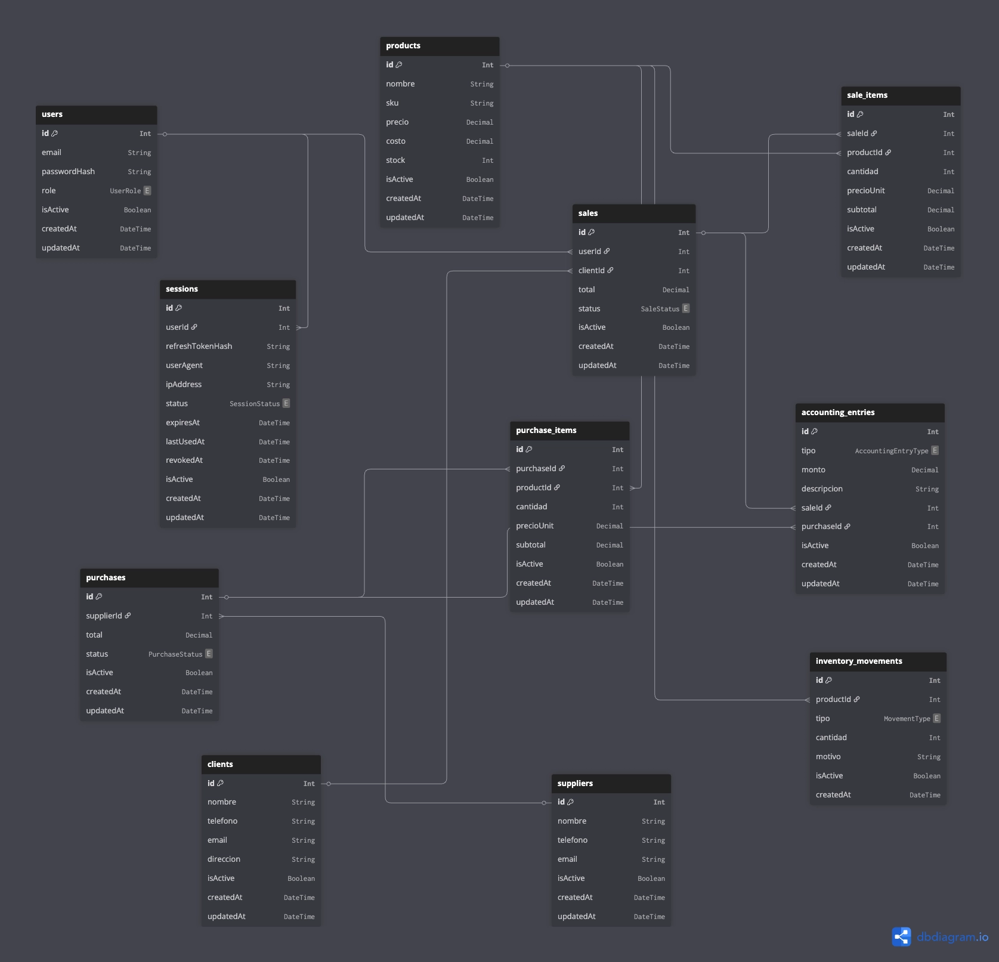

# **Nexora ERP + AI Platform**

## **MVP Completo (Documento Base de Producto)**

---

# **1. Visión del Producto**

**Nexora** es una plataforma ERP moderna para PyMEs comerciales que centraliza operaciones de:

- Ventas
- Compras
- Inventario
- Finanzas básicas
- Reportes
- Automatización con IA

Diseñada con arquitectura moderna:

- Frontend React
- Backend NestJS
- AI Service FastAPI
- PostgreSQL
- RabbitMQ
- Docker
- Cloud Ready

---

# **2. Objetivo del MVP**

Permitir que una pequeña empresa pueda operar su negocio desde una sola plataforma:

- Registrar ventas
- Registrar compras
- Controlar inventario
- Medir ingresos/egresos
- Ver reportes clave
- Recibir insights automáticos con IA

---

# **3. Cliente Ideal**

PyMEs de:

- Tiendas comerciales
- Distribuidores pequeños
- Negocios con almacén
- Retail local
- E-commerce pequeño con inventario físico

---

# **4. Arquitectura MVP**


---

# **5. Módulos MVP**

# **A. Autenticación**

## **Funciones**

- Login JWT
- Refresh tokens
- Logout
- Sesiones activas
- Roles básicos

## **Roles iniciales**

- Admin
- Manager
- Seller

---

# **B. Usuarios**

## **CRUD**

- Crear usuario
- Editar usuario
- Activar/desactivar
- Asignar rol

---

# **C. Productos**

## **CRUD**

- Nombre
- SKU
- Precio venta
- Costo
- Stock
- Categoría
- Estado

## **Extras MVP**

- Búsqueda rápida
- Alertas stock bajo

---

# **D. Clientes**

## **CRUD**

- Nombre
- Teléfono
- Email
- Dirección
- Notas

---

# **E. Proveedores**

## **CRUD**

- Nombre
- Contacto
- Email
- Teléfono

---

# **F. Ventas**

## **Flujo MVP**

1. Crear venta
2. Seleccionar cliente
3. Agregar productos
4. Calcular total
5. Confirmar venta

## **Automatizaciones**

- Descuenta stock
- Registra ingreso contable
- Guarda historial

---

# **G. Compras**

## **Flujo MVP**

1. Crear compra
2. Elegir proveedor
3. Agregar productos
4. Confirmar compra

## **Automatizaciones**

- Aumenta stock
- Registra egreso contable

---

# **H. Inventario**

## **Vista principal**

- Producto
- Stock actual
- Último movimiento

## **Movimientos**

- Entrada por compra
- Salida por venta
- Ajuste manual

---

# **I. Contabilidad básica**

## **Registros automáticos**

- Ingresos
- Egresos

## **Dashboard financiero**

- Total ingresos mes
- Total egresos mes
- Balance

---

# **J. Dashboard General**

## **Widgets**

- Ventas hoy
- Ventas mes
- Compras mes
- Productos bajos
- Top productos
- Balance actual

---

# **6. IA MVP (FastAPI)**

# **Módulo AI Insights**

## **Endpoint 1: Resumen ejecutivo**

Input:

```
{
  "range": "30d"
}
```

Output:

- Ventas +12%
- Producto top X
- Stock crítico en Y

---

## **Endpoint 2: Recomendación de reabastecimiento**

Detecta productos con:

- alta rotación
- bajo stock

---

## **Endpoint 3: Preguntas en lenguaje natural**

Ejemplo:

> ¿Cuál fue mi mejor producto este mes?

FastAPI consulta datos y responde.

---

## **Endpoint 4: Predicción básica ventas**

Forecast próximos 7 días.

---

# **7. RabbitMQ MVP**

Eventos:

```
sale.created
purchase.created
stock.low
user.login
```

Uso:

- IA consume ventas nuevas
- alertas stock
- logs async

---

# **8. Frontend MVP (React)**

## **Páginas**

- Login
- Dashboard
- Productos
- Clientes
- Proveedores
- Ventas
- Compras
- Inventario
- Finanzas
- IA Insights
- Usuarios

---

# **9. UX MVP Importante**

- Sidebar limpia
- Tema dark/light
- Tabla con filtros
- Buscador global
- Toast notifications
- Responsive desktop-first

---

# **10. Seguridad MVP**

- JWT
- Refresh Tokens
- Password hash bcrypt/argon2
- Guards NestJS
- Roles
- Rate limiting login
- Logs básicos

---

# **11. Infraestructura MVP**

## **Local**

Docker Compose:

```
frontend
api
ai-service
postgres
rabbitmq
nginx
```

## **Producción**

- VPS Ubuntu
- Docker Compose
- SSL
- Backup DB diario

---

# **12. Base de Datos MVP**



## **Nuevas tablas:**

- clients
- suppliers
- roles
- permissions
- inventory_movements
- ai_logs
- notifications

---

# **13. Métricas de éxito MVP**

- Registrar venta en <30 segundos
- Dashboard carga <2 segundos
- Stock exacto
- IA útil
- Deploy estable

---

# **14. Roadmap de Desarrollo**

## **Sprint 1**

- Auth
- Productos
- Clientes
- Dashboard

## **Sprint 2**

- Ventas completas
- Inventario automático

## **Sprint 3**

- Compras
- Finanzas básicas

## **Sprint 4**

- FastAPI AI
- RabbitMQ

## **Sprint 5**

- Docker + Nginx + Deploy

---
